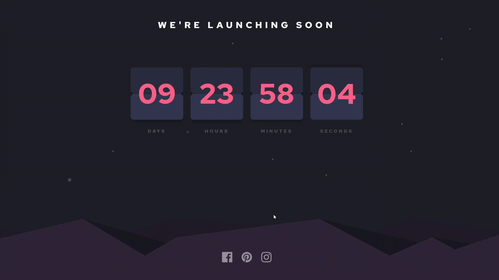
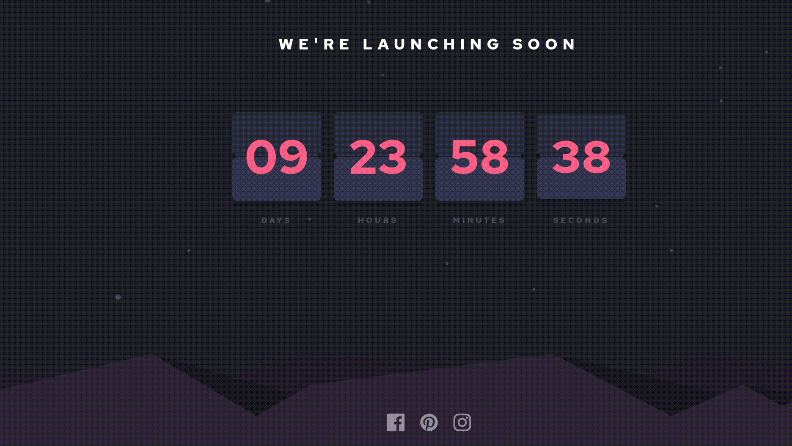

# Frontend Mentor - Launch countdown timer

## O Desafio! 👋

O desafio completo se encontra <a href="https://www.frontendmentor.io/challenges/launch-countdown-timer-N0XkGfyz-">AQUI</a>, mas de forma simplificada é necessário fazer um contador de decrescente de tempo, que na medida que os indicadores de tempo, dia, hora, minuto e segundo se alterem, aplicar um efeito que simule a passagem de tempo.

## A Solução! 👋 e os entraves.

Para resolver o desafio foi definido uma data final mantida pela variavel `endtime`, a partir disso a função `initCount` é iniciada e atualizada em uma taxa de 1s, essa função irá primeiramente calcular a 'distancia' entre a data atual `Date.now()` para a data final `endtime`, o retorno dessa operação é em milessegundos que, serão convertidos nos respectivos parâmetros de dia, hora, minuto e segundos, a partir disso esses valores são atribuidos as suas respectivas `div's`.

Já para a 'flipagem' das `div's` durante a mudança de fase (hora mudar), a melhor solução que encontrei foi utilizar as propriedades `setTimeout` e `setInterval` com uma taxa de atualização pequena, para dar a impressão de um efeito de calendario. Contudo estou estudando para tentar deixar mais fluida a transição como pode ser visto no arquivo `script-v2.js` e na **gif** logo abaixo, aonde utilizo a propriedade `requestAnimatedFrame`, muito embora esteja encontrando alguns problemas para fazer a transição dos demais elementos (minutos, horas e dias) de maneira à não sr cair em um loop.

